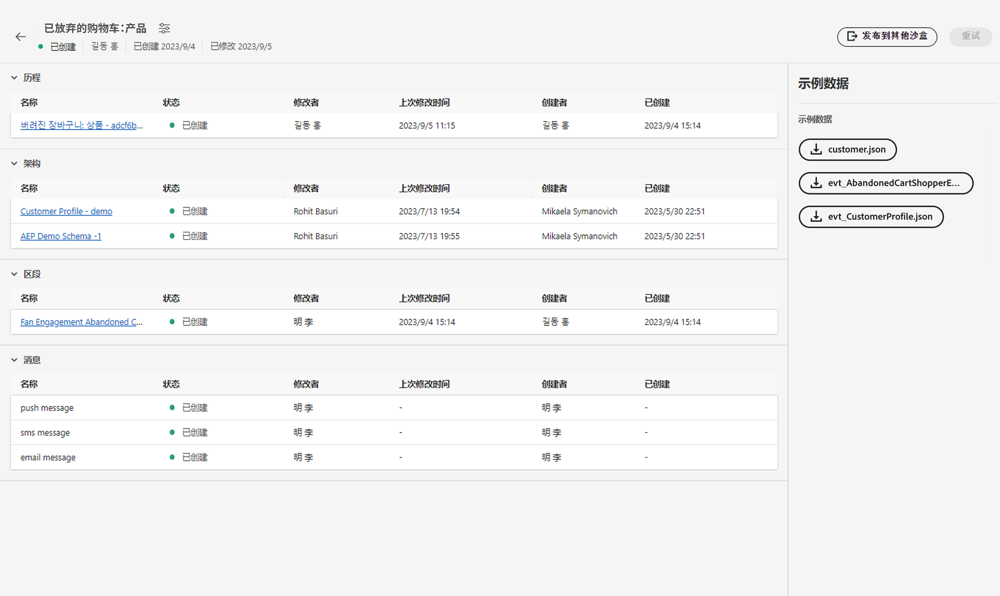
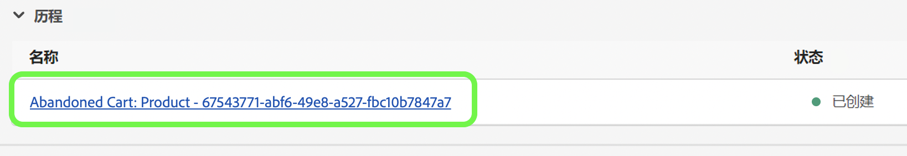
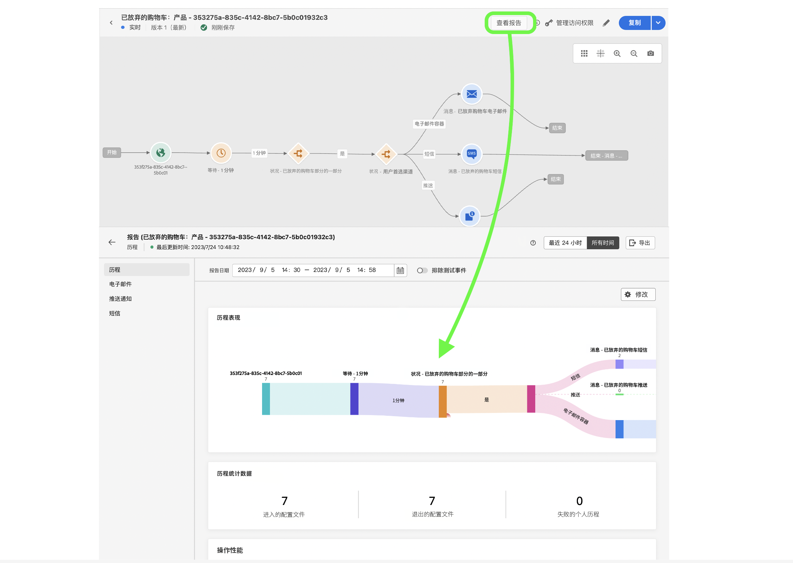

# 单一事件

## 要遵循的步骤 {#steps-to-follow}

>[!CONTEXTUALHELP]
>id="marketerexp_sampledata_unitaryevent"
>title="如何使用？"
>abstract="有关更多详细信息，请访问链接"

>[!IMPORTANT]
>
>这些说明可能会因以下原因而更改： **[!UICONTROL 剧本]** 因此，请始终参阅各自的Sample data部分 **[!UICONTROL 剧本]**.

## 先决条件

* 您必须安装Postman软件
* 使用Playbook创建实例资源，如 **[!UICONTROL 历程]**， **[!UICONTROL 架构]**， **[!UICONTROL 区段]**， **[!UICONTROL 消息]** 等等。

创建的资源将显示在 `Bill Of Material` 页面



## 使用所需的收藏集准备Postman

1. 访问 **[!UICONTROL 用例剧本]** 应用程序。
1. 单击相应的 **[!UICONTROL 剧本]** 要访问的卡片 **[!UICONTROL 剧本]** 详细信息页面。
1. 访问 **[!UICONTROL 物料清单]** 页面并查找 **[!UICONTROL 示例数据]** 部分。
1. 下载 `postman.json` ，方法是单击UI上的相应按钮。
1. 导入 `postman.json` 在 **[!DNL Postman Software]**.
1. 为此验证创建一个专用的Postman环境(例如， `Adobe <PLAYBOOK_NAME>`)。

## 获取IMS令牌

>[!NOTE]
>
>所有环境变量都区分大小写，因此请始终使用准确的变量名称。

1. 请关注 [验证和访问Experience PlatformAPI](https://experienceleague.adobe.com/docs/experience-platform/landing/platform-apis/api-authentication.html) 文档来生成访问令牌。
1. 将访问令牌值存储在名为的环境变量中 `ACCESS_TOKEN`.
1. 存储其他身份验证相关的值，如 `API_KEY`， `IMS_ORG` 和 `SANDBOX_NAME` 环境变量中的。

>[!IMPORTANT]
>
>在从Postman执行任何API之前，请确保添加所有必需的环境变量。

## 发布行动手册创建的历程

发布历程的方式有两种；您可以选择任意一种：

1. **使用AJO UI**  — 单击历程链接 `Bill Of Material Page`；这会将您重定向到可单击的历程页面 **[!UICONTROL Publish]** 按钮和历程将会发布。

   

1. **使用Postman API**

   1. 触发器 **[!DNL Publish Journey]** 请求自 **[!DNL Journey Publish]** > **[!DNL Queue journey publish job]**.
   1. 历程发布可能需要一些时间，因此要检查状态，请执行检查历程发布状态API，直到 `response.status` 是 `SUCCESS`，请确保等待10-15秒（如果历程发布需要时间）。

   >[!NOTE]
   >
   >所有环境变量都区分大小写，因此请始终使用准确的变量名称。

## 摄取客户配置文件

>[!TIP]
>
>您可以通过附加来重复使用相同的电子邮件地址 `+<variable>` 放入您的电子邮件中，例如 `usertest@email.com` 可以恢复为 `usertest+v1@email.com` 或 `usertest+24jul@email.com`. 如果每次都有一个新的用户档案，但仍使用相同的电子邮件ID，这会很有帮助。

1. 首次访问的用户需要创建 **[!DNL customer dataset]** 和 **[!DNL HTTP Streaming Inlet Connection]**.
1. 如果您已创建 **[!DNL customer dataset]** 和 **[!DNL HTTP Streaming Inlet Connection]**，请跳到步骤 `5`.
1. 触发器 **[!DNL Customer Profile Ingestion]** > **[!DNL Create Customer Profile InletId]** > **[!DNL Create Dataset]** 创建 **[!DNL customer dataset]**；这将存储 `CustomerProfile_dataset_id` 在postman环境变量中。
1. 创建 **[!DNL HTTP Streaming Inlet Connection]**，在下使用Postman API **[!DNL Customer Profile Ingestion > Create Customer Profile InletId]**.

   1. `CustomerProfile_dataset_id` 必须在postman环境变量中可用，否则请参阅步骤 `3`.
   1. 触发器 **[!DNL `CREATE Base Connection`]** 到 [!DNL create base connection].
   1. 触发器 **[!DNL `CREATE Source Connection`]** 到 [!DNL create source connection].
   1. 触发器 **[!DNL `CREATE Target Connection`]** 到 [!DNL create target connection].
   1. 触发器 **[!DNL `CREATE Dataflow`]** 到 [!DNL create dataflow].
   1. 触发器 **[!DNL `GET Base Connection`]** — 这将自动存储 `CustomerProfile_inlet_id` 在postman环境变量中。

1. 在此步骤中，您必须拥有 `CustomerProfile_dataset_id` 和 `CustomerProfile_inlet_id` 在postman环境变量中；如果不能，请参阅步骤 `3` 或 `4` 的量度。
1. 要摄取客户，用户需要存储 `customer_country_code`， `customer_mobile_no`， `customer_first_name`， `customer_last_name` 和 `email` 在postman环境变量中。

   1. `customer_country_code` 是手机号码的国家/地区代码，例如 `91` 或 `1`
   1. `customer_mobile_no` 是手机号码，例如 `9987654321`
   1. `customer_first_name` 是用户的名字
   1. `customer_last_name` 是用户的姓氏
   1. `email` 将是用户的电子邮件地址，这对于使用不同的电子邮件ID以便摄取新的用户档案至关重要。

1. 更新Postman请求 **[!DNL Customer Ingestion]** > **[!DNL Customer Streaming Ingestion]** 更改客户的首选渠道；默认情况下 [!DNL `email`] 在请求中配置。

   ```js
   "consents": {
       "marketing": {
           "preferred": "email",
           "email": {
               "val": "y"
           },
           "push": {
               "val": "n"
           },
           "sms": {
               "val": "n"
           }
       }
   }
   ```

1. 将首选渠道更改为 `sms` 或 `push` 并将相应的渠道值设为 `y` 和 `n` 更改为其他值，例如

   ```js
   "consents": {
       "marketing": {
           "preferred": "sms",
           "email": {
               "val": "n"
           },
           "push": {
               "val": "n"
           },
           "sms": {
               "val": "y"
           }
       }
   }
   ```

1. Finally触发器 **[!DNL `Customer Profile Ingestion > Customer Profile Streaming Ingestion`]** 以摄取客户配置文件。

## 引入事件

1. 首次用户需要创建 **[!DNL event dataset]** 和 **[!DNL HTTP Streaming Inlet Connection for events]**
1. 如果您已创建 **[!DNL event dataset]** 和 **[!DNL HTTP Streaming Inlet Connection for events]**，请跳到步骤 `5`.
1. 触发器 **[!DNL `Schemas Data Ingestion > AEP Demo Schema Ingestion > Create AEP Demo Schema InletId > Create Dataset`]** 创建 **[!DNL event dataset]**，这将存储 `AEPDemoSchema_dataset_id` 在邮递员环境变量中
1. 创建 **[!DNL HTTP Streaming Inlet Connection for events]**，在下使用Postman API **[!DNL Schemas Data Ingestion]** > **[!DNL AEP Demo Schema Ingestion]** > **[!DNL Create AEP Demo Schema InletId]**.

   1. `AEPDemoSchema_dataset_id` 必须在postman环境变量中可用，否则请参阅步骤 `3`
   1. 触发器 **[!DNL `CREATE Base Connection`]** 到 [!DNL create base connection]
   1. 触发器 **[!DNL `CREATE Source Connection`]** 到 [!DNL create source connection]
   1. 触发器 **[!DNL `CREATE Target Connection`]** 到 [!DNL create target connection]
   1. 触发器 **[!DNL `CREATE Dataflow`]** 到 [!DNL create dataflow]
   1. 触发器 **[!DNL `GET Base Connection`]** — 这将自动存储 `AEPDemoSchema_inlet_id` 在postman环境变量中

1. 在此步骤中，您必须拥有 `AEPDemoSchema_dataset_id` 和 `AEPDemoSchema_inlet_id` 在postman环境变量中，如果不能，请参阅步骤 `3` 或 `4` 分别为
1. 要摄取事件，用户需要更改时间变量 `timestamp` 在请求正文中 **[!DNL Schemas Data Ingestion]** > **[!DNL AEP Demo Schema Ingestion]** > **[!DNL AEP Demo Schema Streaming Ingestion]** 邮递员。

   1. `timestamp` 如果发生事件的时间，则使用当前时间戳，例如 `2023-07-21T16:37:52+05:30` 根据需要调整时区。

1. 触发器 **[!DNL Schemas Data Ingestion > AEP Demo Schema Ingestion > AEP Demo Schema Streaming Ingestion]** 以摄取事件，从而触发历程

## 最终验证

您必须在使用的所选首选渠道上接收消息 **[!DNL Ingest the Customer Profile]** 步骤 `8`

* `SMS` 如果首选渠道为 `sms` 日期 `customer_country_code` 和 `customer_mobile_no`
* `Email` 如果首选渠道为 `email` 日期 `email`

或者，您可以检查 `Journey Report`，要检查它，请单击 `Journey Object` 日期 `Bill of Materials page` 这会将您重定向到 `Journey Details page`.

对于任何已发布的历程，用户必须获取 **[!UICONTROL 查看报告]** 按钮



## 清理

请不要有多个实例 `Journey` 如果该历程仅在验证完成后才用于验证，请停止该活动。
